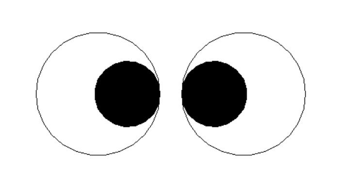

# Fun_With_Python
#### This is a repository created by ASamanta to show his creativity while learning Python.
#### The below one are the files which are in this repository:-
- <a href="/Fun_Eye.py">Fun_Eye.py</a>
- <a href="/Fun_Heart.py">Fun_Heart.py</a>
- <a href="/Fun_Smile.py">Fun_Smile.py</a>
- <a href="/Fun_Flower.py">Fun_Flower.py</a>
---
<h3>Fun_Eye Graphic image</h3>

<h3>Fun_Heart Graphic image</h3>

<h3>Fun_Smile Graphic image</h3>

<h3>Fun_Flower Graphic image</h3>

